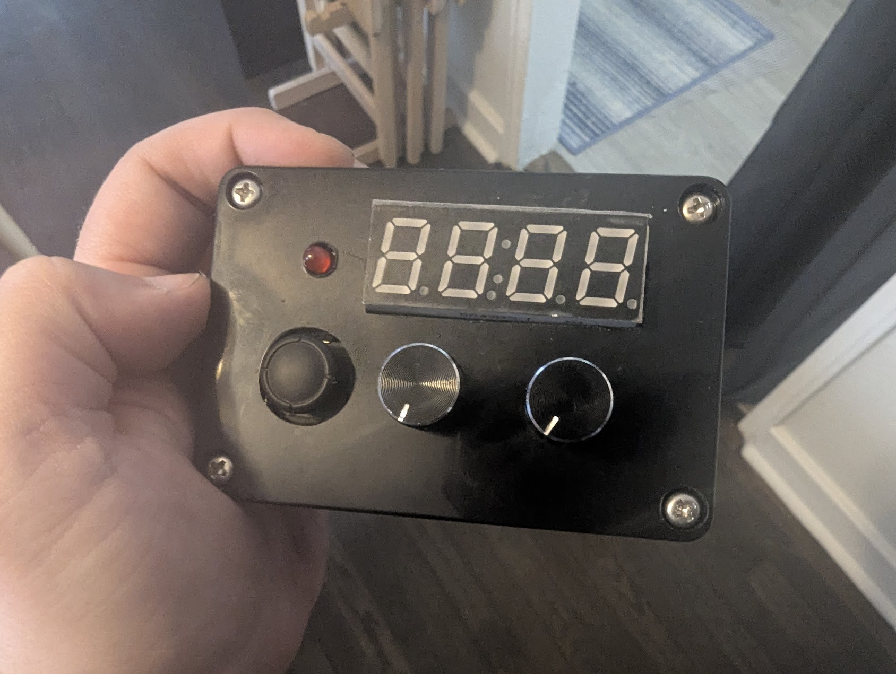
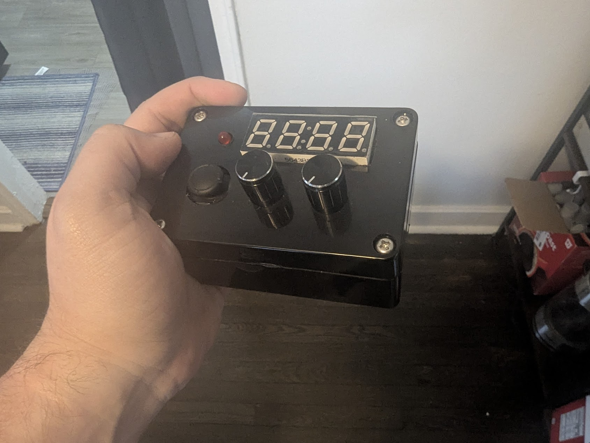

# 🎲 D20DX

**D20DX** is a standalone dice rolling device powered by a Raspberry Pi Pico. It supports multiple dice types, coin flips, and critical roll feedback — all with physical controls and audio-visual feedback.

---

## ✨ Features

- Selectable dice types: d4, d6, d8, d10, d12, d20, d100
- Configurable number of dice (1–9)
- Coin flip mode with distinct chimes for HEAD or TAIL
- Audio feedback via passive speaker
- Critical roll detection with flashing + tone
- Adjustable display and LED brightness
- Adjustable sound volume: MUTE / LOW / HIGH
- Idle dimming and animated boot sequence
- Entropy pool-based random seed generation

---

## 🧰 Hardware Used

- Raspberry Pi Pico
- TM1637 4-digit 7-segment display
- 2x 10k potentiometers
- Analog joystick (X-axis + button used)
- Passive speaker
- Status LED (PWM controlled)
- 3x pushbuttons (Volume, Brightness, Mode Toggle)
- TP4056 charging board + 18650 battery

---

## 🔌 Pin Mapping

| Function          | GPIO | Notes                          |
|-------------------|------|--------------------------------|
| Display CLK       | GP0  | TM1637                         |
| Display DIO       | GP1  | TM1637                         |
| Joystick Button   | GP2  | Coin flip trigger              |
| Volume Button     | GP5  | Cycle MUTE / LO / HI           |
| Brightness Button | GP4  | Adjust brightness              |
| Status LED        | GP6  | Red LED (PWM)                  |
| Speaker           | GP7  | Passive buzzer                 |
| Mode Button       | GP8  | Arbitrary mode toggle *(disabled)* |
| Pot 1 (Die type)  | GP26 | ADC0                           |
| Pot 2 (Die count) | GP27 | ADC1                           |
| Joystick X-axis   | GP28 | ADC2                           |

---

## 📁 Project Structure

```
D20DX/
├── src/                    # Source code
│   ├── __init__.py        # Package initialization
│   ├── main.py            # Main application code
│   └── requirements.txt   # Python dependencies
├── hardware/              # Hardware design files
│   └── KiCad Files/      # PCB design files
├── docs/                  # Documentation
├── LICENSE               # License file
└── README.md            # This file
```

## ⚙️ Setup & Usage

1. Flash the Pico with MicroPython
2. Upload the contents of the `src` directory to your Pico
3. Power via USB or TP4056 module + battery
4. Use potentiometers to select dice type and count
5. Flick the joystick to roll dice
6. Press joystick button to flip a coin
7. Use buttons to adjust volume and brightness

---

## 🎶 Sound Behavior

- 🎵 **Startup jingle** follows animated boot sequence
- 🔊 **Critical rolls**: rising/falling tone + display flash
- 🪙 **Coin flip**: ascending chime for HEAD, descending chime for TAIL
- 🎚 **Volume control**:
  - `MUTE`: Center bars only
  - `LO`: Displays `LO`
  - `HI`: Displays `HI`

---

## 🚧 Planned / Optional

- Arbitrary mode for d3–d100 (toggleable, currently disabled)
- External ADC support (e.g. ADS7830)

---

## 📷 Project Photos / Demo

[](https://youtu.be/pKyViXFRKMA)

Click the thumbnail above to watch the demo video on YouTube.

<div align="center">
  
  
</div>

---

## 📄 License

This project is licensed under the Creative Commons Attribution-NonCommercial-ShareAlike 4.0 International License (CC BY-NC-SA 4.0).

This means you are free to:
- Share — copy and redistribute the material in any medium or format
- Adapt — remix, transform, and build upon the material

Under the following terms:
- Attribution — You must give appropriate credit, provide a link to the license, and indicate if changes were made
- NonCommercial — You may not use the material for commercial purposes
- ShareAlike — If you remix, transform, or build upon the material, you must distribute your contributions under the same license as the original

For more information, visit [creativecommons.org/licenses/by-nc-sa/4.0/](http://creativecommons.org/licenses/by-nc-sa/4.0/)